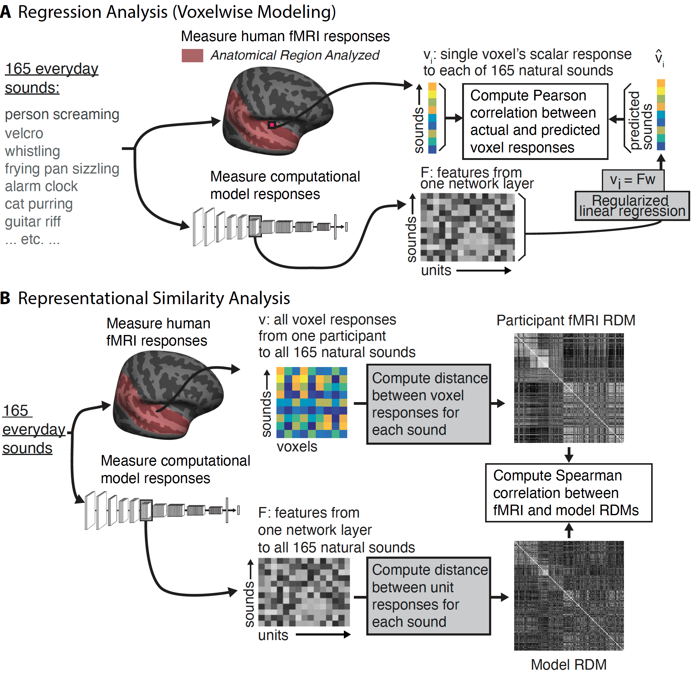

## Many but not all deep neural network audio models capture brain responses and exhibit correspondence between model stages and brain regions

This repository contains code and data accompanying: 
Greta Tuckute*, Jenelle Feather*, Dana Boebinger, Josh H. McDermott (2023): _Many but not all deep neural network audio models capture brain responses and exhibit correspondence between model stages and brain regions_.

[](https://zenodo.org/badge/latestdoi/592514950)

## Environment
The environment does not require any sophisticated packages and would run in most Python 3.6 environments with [pandas](https://pandas.pydata.org/), [scikit-learn](https://scikit-learn.org/stable/), [statsmodels](https://www.statsmodels.org/stable/index.html), [seaborn](https://seaborn.pydata.org/) and [matplotlib](https://matplotlib.org/). However, to use the exact Python 3.6.10 environment used in the paper, install it as:

```
conda env create -f env_auditory_brain_dnn.yml
```

## Downloading data
To download data used in the paper, run the [download_files.py](https://github.com/gretatuckute/auditory_brain_dnn/blob/main/setup_utils/download_files.py) script. You can specify what you want to download according to the four flags: 1) _get_data = True_ will download the two neural datasets (NH2015, B2021) and the component dataset (NH2015comp). 2) _get_model_actv = True_ will download the activations of the models used in the paper. 3) _get_results = True_ will download the outputs of the analyses in the paper. 4) _get_fsavg_surf = True_ will download the surface maps in the paper.

## Obtaining predictivity scores for DNNs
We used to common model-brain evaluation metrics, namely regression and representational similarity analysis (RSA), as demonstrated in the figure below.




### Regression
To perform regression from DNN activations (regressors) to brain/component responses, run [/aud_dnn/AUD_main.py](https://github.com/gretatuckute/auditory_brain_dnn/blob/main/aud_dnn/AUD_main.py). This script 1. Loads a DNN unit activations from a given model (*source_model*) and layer (*source_layer*), 2. Loads the target (*target*) of interest (either neural data: *NH2015* (Norman-Haignere et al., 2015; 7,694 voxels across 8 participants) or *B2021* (Boebinger et al., 2021; 26,792 voxels across 20 participants), or component data *NH2015comp* (Norman-Haignere et al., 2015; 6 components), 3. Runs a ridge-regression across 10 splits of the data (165 sounds; 83 sounds in train and 82 sounds in test) and stores the outputs in /results/ in subfolders with an identifier corresponding to the DNN name.

### Representational Similarity Analysis (RSA)
To reproduce all RSA analyses in the paper, run [/aud_dnn/analyze/rsa_matrix_calculation_all_models.py](https://github.com/gretatuckute/auditory_brain_dnn/blob/main/aud_dnn/analyze/rsa_matrix_calculation_all_models.py). A call to this script from the command line will run all RSA analyses and exports results into the /results/rsa_anlaysis directory. If the specified analysis is already present in the directory, the results will be loaded to make the plots. 

#### Note on how DNN unit activations are organized
In the study we used either in-house models (trained by us, in lab) or external models (publicly available models). Both types of model activations are loaded using the function [get_source_features](https://github.com/gretatuckute/auditory_brain_dnn/blob/main/aud_dnn/utils.py#L211) which for in-house models will load the activations stored in a single h5 file (see e.g., /model-actv/Kell2018word/natsound_activations.h5). For external models, the model activations are stored as a single pickle file per sound using each sound's identifier (see e.g., /model-actv/S2T/stim5_alarm_clock_activations.pkl) which contains the activations across layers for the sound "stim5_alarm_clock" according to the sound nomenclature (see /data/stimuli/ -- the corresponding sound file would be named "stim5_alarm_clock.wav"). The [PytorchWrapper class](https://github.com/gretatuckute/auditory_brain_dnn/blob/main/aud_dnn/utils.py#L104) loads and concatenates these individual pickle files according to the specified sound order.
For both in-house and external models, we denote model activations obtained using a permuted network architecture with "_randnetw", e.g. /model-actv/Kell2018word/natsound_activations_randnetw.h5 or /model-actv/S2T/stim5_alarm_clock_activations_randnetw.pkl).


## Generating plots
The figures in the paper can be reproduced via the notebooks in the [analyze/generate_figures/](https://github.com/gretatuckute/auditory_brain_dnn/tree/main/aud_dnn/analyze/generate_figures) directory, e.g., [generate_Figure2.ipynb](https://github.com/gretatuckute/auditory_brain_dnn/blob/main/aud_dnn/analyze/generate_figures/generate_Figure2.ipynb) and so forth.

## DNN activations

### In-house models
The following repository contains checkpoints for loading the in-house trained CochCNN9 and CochResNet50 models:

[CochDNN](https://github.com/jenellefeather/cochdnn)<br>

### External models (publicly available)
The following repositories were used to extract DNN representations from the external DNN models:

[AST](https://github.com/gretatuckute/ast)<br>
[DCASE2020](https://github.com/gretatuckute/dcase-2020-baseline)<br>
[DeepSpeech2](https://github.com/gretatuckute/deepspeech.pytorch)<br>
[MetricGAN](https://github.com/gretatuckute/speechbrain_activation_extraction)<br>
[SepFormer](https://github.com/gretatuckute/speechbrain_activation_extraction)<br>
[S2T](https://github.com/gretatuckute/asr)<br>
[VGGish](https://github.com/gretatuckute/torchvggish)<br>
[wav2vec](https://github.com/gretatuckute/asr)<br>
[VQ-VAE (ZeroSpeech)](https://github.com/gretatuckute/ZeroSpeech)<br>

We thank the authors and developers for making these weights publicly available!
The permuted weight indices that were used to extract permuted model activations can be [downloaded here](https://drive.google.com/drive/folders/1yySqaHAC-Zda23IXaRtNOtg-pgf54dWa?usp=sharing) for each model. 

## Citation
To be updated with the true reference.
```
@article{TuckuteFeather2023,
	author = {Greta Tuckute and Jenelle Feather and Dana Boebinger and Josh H. McDermott},
	doi = {10.1101/2022.09.06.506680},
	elocation-id = {2022.09.06.506680},
	eprint = {https://www.biorxiv.org/content/early/2023/06/14/2022.09.06.506680.full.pdf},
	journal = {bioRxiv},
	publisher = {Cold Spring Harbor Laboratory},
	title = {Many but not all deep neural network audio models capture brain responses and exhibit correspondence between model stages and brain regions},
	url = {https://www.biorxiv.org/content/early/2023/06/14/2022.09.06.506680},
	year = {2023},
	bdsk-url-1 = {https://www.biorxiv.org/content/early/2023/06/14/2022.09.06.506680},
	bdsk-url-2 = {https://doi.org/10.1101/2022.09.06.506680}}
```
